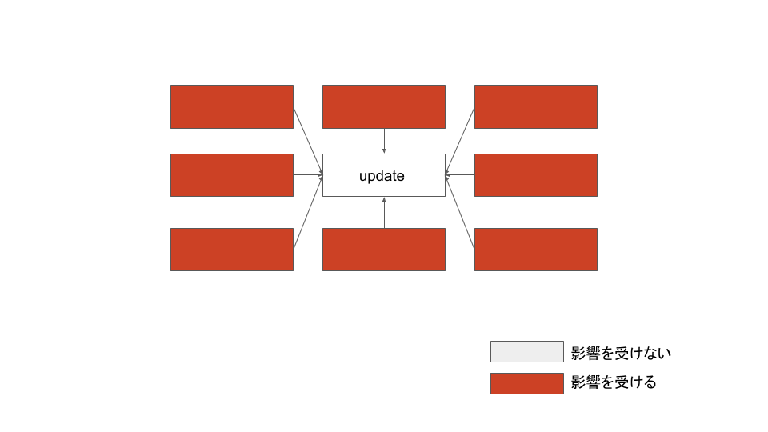
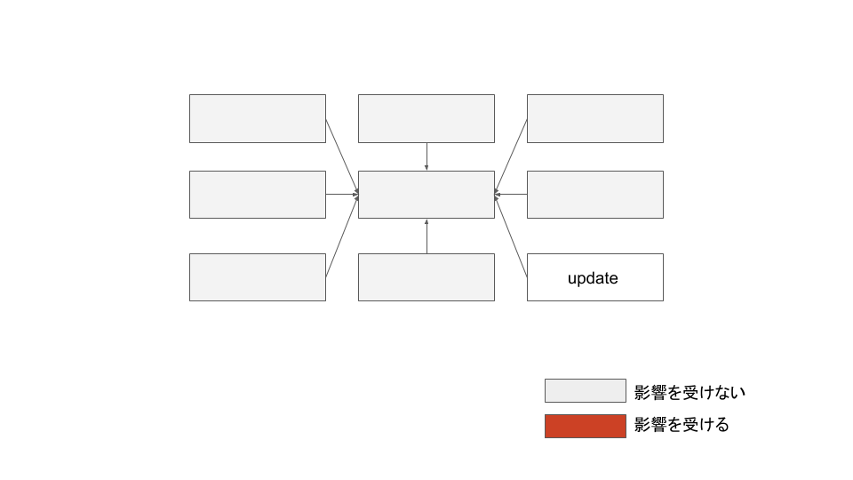

# 開発の方針

CleanArchitecture + MVVM + RxSwiftをベースとした設計について記事にします.

## CleanArchitecture

前提として，CleanArchitectureは，あくまで開発の方針を定義づけるものであり，他のアーキテクチャとの併用も考えられます．  
巷で出回っている「UseCase」「Presenter」「Model」「Translator」「Repository」「DataStore」「Entity」「View」のようなレイヤーに必ずしも分類する必要はありません．　　
また，このアーキテクチャは，「コード量が増える」「実装が遅くなる」という懸念がありますが，筆者はむしろ，開発速度が向上すると考えています．

CleanArchitectureを利用する目的としては，以下を挙げます．

- 変更のしやすさの向上
- デグレーションの防止
- 依存関係の明確化
- テスタブル

オブジェクトを変更する必要があった場合，そのオブジェクトに依存しているオブジェクトがあれば，当然影響が出ますし，デグレーションが発生する可能性も考慮する必要も出てきます．
依存するオブジェクトが多ければ，それだけ影響範囲も広くなりますし，そもそも下手にオブジェクトを変更できない，なんて状況に追い込まれます．

逆にオブジェクトを変更する必要があった場合，そのオブジェクトに依存しているオブジェクトがなければ，影響範囲はそのオブジェクトだけに限られます．

これらのことから，複数のオブジェクトから依存されるオブジェクトとしては，変更される可能性が低くなるように設計することが大事になってきます．

また，特定のテストしにくい機能(たとえばiOSの認証機能呼び出し)に依存したUseCaseを実装する必要がある場合，テストがしにくくなります．そのため，直接その機能をUseCaseから呼び出すのではなく，プロトコルを切るようにします．そうすることで，テストする際はStubを差し込むことでテストできます．

## MVVM

画面に対する操作を状態として表現できるパターンです．
同一のUIプロパティに対する操作する処理が分散している場合，
どこから状態を操作しているかを把握しきれなくなります．
操作を状態として一箇所で表現しできれば，どのように状態が変化するかが把握しやすくなります．

## RxSwift

RxSwiftは単一のライブラリでありながら，多くのメリットを受けられます．  

- 並列処理や，処理の順番の制御が容易
- DelegateやNotificationなど，あらゆる形式に対して画一的に記述可能
- ネストが深くならない
- エラー処理がしやすい
- エラー処理を正常系から分離しやすい
- インジケータをより安全に制御しやすい
- メインスレッドでの動作の管理がしやすい
- 連打対策や，処理のキャンセル(後がち，先がち)の制御が容易

## 参考

- [Clean-Architecture-達人に学ぶソフトウェアの構造と設計](https://www.amazon.co.jp/Clean-Architecture-達人に学ぶソフトウェアの構造と設計-Robert-C-Martin/dp/4048930656/ref=sr_1_1?ie=UTF8&qid=1543145654&sr=8-1&keywords=クリーン+アーキテクチャ)
- https://github.com/sergdort/CleanArchitectureRxSwift
