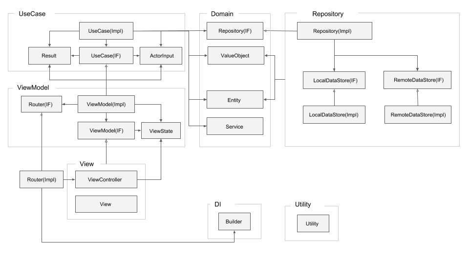

# 開発の詳細

開発の方針の詳細を載せていきます．
CleanArchitecture + MVVM + RxSwiftを用いた開発の設計概要をクラス図を用いて示しておきます．



## Viewcontroller

ViewControllerが直接依存するViewModelの数は1となります．  
今の筆者の考えだと，コード量が増えたとしても分割するべきではないと考えています．
なお，Viewに関してはViewModelは持たせません.
ViewControllerはテスタブルではないので，極力ロジックを記載しないように，注意が必要です．たとえば，TableViewでUIを構成する場合，SectionやRow, 表示する項目の構成はViewModelから受け取るViewStateに基づいてUIを構成するようにします．


Sample

```
final class IllustRankingViewController: UIViewController {

    let viewModel: IllustRankingViewModel!
    private let disposeBag = DisposeBag()

    override func viewDidLoad() {
        super.viewDidLoad()
        self.setupUi()
        self.bindViewModel()
    }

    private func setupUi() {
        // 状態を持たないテキストやカラー，Uiの生成や設定はここで指定します．
    }

    private func bindViewModel() {
        // delegateやnotoficationCenterなどを利用するパターンの場合，
        // その画面が，どのようなイベントに関心があるのかが把握しにくいのですが，
        // この方式を取ることで，関心のあるイベントを俯瞰できるようになります．
        // delegateやnotoficationCenterはRxを利用すること表現を統一できます．
        let event = IllustRankingEvent(
            viewWillAppear: rx.sentMessage(#selector(viewWillAppear(_:))).asDriverOnErrorJustComplete(),
            didBecomeActive: NotificationCenter.default.rx.notification(NSNotification.Name.UIApplicationDidBecomeActive).asDriverOnErrorJustComplete(),
            detailButtonTap: self.detailButton.rx.tap.asDriver()
        )
        // transformメソッドから受け取ったViewの状態をUiとバインドします．
        let viewState = self.viewModel.transform(event)
        viewState.hogeLabelText.drive(self.hogeLabel.rx.text).disposed(by: self.disposeBag)
        // UILabelのtextのように，そのままではバインドできないものに関してはBinderを利用します．
    }

}

```

## ViewModel

ViewModelの責務としては，

- ViewControllerから受け取ったEventをトリガーとしてUseCaseを実行
- UseCaseを実行した結果やEventを組み合わせて画面の状態を表現
- ViewControllerから受け取ったEventをトリガーとしてRouterを実行

が挙げられます．

ViewModelでは，ViewControllerからEventを受け取り，Viewの状態を表現します． 
受け取ったイベントをUseCaseのトリガーとして渡し，処理結果や他のイベントを組み合わせて画面の状態を表現します．  
このとき，UseCaseの結果を別のUseCaseのトリガーに繋げるのは禁止されます．  
これはViewModelが処理の手順(業務手順=UseCase)の責務を負ってしまうことを意味するからです．定義されるUseCaseはイベントの数と一致するようにします．
また，UseCaseにViewModelから渡されるトリガーには，必要に応じてアクターからの入力データ(ActorInput)が渡されます．  
このとき，ズルしてEntityを渡したり，あるいは，アクターからの入力データではないもの(定数をViewModelで指定するなど)を行ってはなりません．

また，画面遷移はrouterを呼び出して処理します．このとき，Viewの状態を表現している訳ではないため，ViewStateに繋げずにdriveします(厳密にはUseCaseに繋げた方がいい気もしますが，それが有効になる想定が低いなら，介さなくてもいいかと思ってます)．

なお，ViewModelはテスタブルであるため，UIKitなどは利用しないように設計します．

Sample

```

protocol IllustRankingViewModel {
    func transform(_ event: IllustRankingEvent) -> IllustRankingViewState
}

struct IllustRankingEvent {
    let homeButtonTap: Driver<()>
    let fugaButtonDidTap: Driver<()>
}

struct IllustRankingViewState {
    let piyoLabelText: Driver<String>
}

struct IllustRankingViewModelImpl: IllustRankingViewModel {

    private let illustRankingRefarenceUseCase: IllustRankingRefarenceUseCase

    private let router: IllustRankingRouter
    private let disposeBag = DisposeBag()

    init(router: IllustRankingRouter,
        illustRankingRefarenceUseCase: IllustRankingRefarenceUseCase) {
        self.router = router
        self.illustRankingRefarenceUseCase = illustRankingRefarenceUseCase
    }

    func transform(_ event: IllustRankingEvent) -> IllustRankingViewState {
    　　 
        event.homeButtonTap.do { onNext: self.router.transitionToHome }.drive().disposed(by: self.disposeBag)
    　　 
        let fugaUseCaseResult = self.fugaUseCase.act(trigger: event.fugaButtonDidTap)
    　　 
        piyoLabelText = fugaUseCaseResult.message
    　　 
        return IllustRankingViewState(
            piyoLabelText: piyoLabelText
        )
    }
}
　　 
```
　　 
## UseCase
　 
UseCaseはViewModelからのみ呼び出されます．UseCaseの責務としては，Domainを組み合わせ，アプリケーションロジック(業務手順)を表現し，その処理結果(UseCaseResult)を外部に公開することです．
UseCaseはViewModelのEvent単位で定義し，依存元は1ViewModelに限定し再利用はという観点には立ちません．
似た画面があり，同じアプリケーションロジックであっても，UseCaseは再利用しません．時間が経過することで依存元によって，仕様が変更されることは容易に想定できます．

UseCaseには原則としてactメソッドのみを定義します．
このとき，引数としてEventが渡されますがその数は1になるようにします．
たとえば，画面表示時と更新ボタンタップ時に実施する処理が同じであったとしても，処理は分けるべきです．

戻り値のResultにはEntityは含めず，必要な形式(Model)及びプリミティブ型のDriverで構成されたオブジェクトとなります．エラーが発生した場合には，UseCaseで処理し，その処理結果をViewModelに伝える必要があれば，Resultに組み込みます．
 
なお，UseCaseはテスタブルであるため，テストが難しくなるような特定のフレームワークにしないように設計します．また，今回はRepositoryパターンを組み合わせるため，キャッシュ, DB, API, Serverと言った表現が登場しないように注意します．
　 
Sample
　　 
```
protocol IllustDetailRefarenseUseCase {
　　func act(trigger: Driver<IllustDetailRefarenseActorInput>) -> IllustDetailRefarenseResult
}
　　 
struct IllustDetailRefarenseActorInput {
　　 let contentId: String
}

struct IllustDetailRefarenseResult {
　　 let illustDetailModel: Driver<IllustDetailModel>
　　 let errorMessage: Driver<string>
}
　　 
struct IllustDetailRefarenseUseCaseImpl: IllustDetailRefarenseUseCase {
　　 func act(trigger: Driver<IllustDetailRefarenseActorInput>) -> IllustDetailRefarenseResult {
　　     ...
    　　 return IllustDetailRefarenseResult(
        　　 illustDetailModel: illustDetailModel,
        　　 errorMessage: errorMessage
    　　 )
　　 }
}
 ```
　　 
## Domain
　　 
Dominとしては，Entity, ValueObject, Service, Repositoryのinterfaceが該当します．
Entityは，単なるデータ構造ではなく，メソッドや計算型プロパティも定義されます．
このときデータベースやAPIのレスポンス形式などに依存するのではなく，業務ロジックを遂行するに当って都合のいい表現となるように定義します．

ここに属するオブジェクトは，複数のオブジェクトから依存される可能性があります．逆に特定のUseCaseからしか利用できない処理は定義されません．DomainはUseCaseまたはRepositoryからの依存しか受け付けません． 

Sample
　　 
```
struct Content: Equatable {
　　 let id: String
　　 let contentType: ContentType
　　 let url: URL
}

extension Content: Equatable {
　　 static public func ==(lhs: Content, rhs: Content) -> Bool {
　　    return lhs.id == rhs.id
　　 }
}
　　 
enum ContentType {
　　 case illust
　　 case novel
}
　　 
```
　　 
## Repository
　　 
Repositoryでは，データをRemoteまたはLocalで永続化制御を実施します．特定の条件に従って，RemoteまたはLocalのどちらで処理を実施するかの判断もここで実施されます．特定の条件としては，Remote取得時から30分が経過している場合はLocalのキャッシュを削除してRemoteから，そうでなければLocalからデータを取得する，などが挙げられます．

Repositoryのinterface上では，RemoteまたはLocalという表現は現れず，特定の条件に関する表現(「キャッシュ」など)も含まれません．Repositoryの実装上では含まれます． 

なお，Remote，Loacalという抽象的な表現に止めるべきであり，たとえば，APIやDatabase, より具体的なRealmやAlamofireという表現をするべきではないと筆者は考えます．LocalはDatabaseとは限らず，UserDafultsを用いるパターンもありますし，RemoteもApiだけでなくBluetooth接続されたデバイスに保存するパターンも想定されるからです．

定義されるRepositoryのinterfaceの単位は，集約エンティティの数と一致します． 
定義されるメソッド名としては，`create` `read` `update` `delete`などが挙げられます．
readの場合，idをキーとして単一で返すか，コレクションとして返すかでメソッドの定義が別れます．

Sample
　　 
```
protocol IllustDetailContentRepository {
　　 func create(_ illustDetailContent: IllustDetailContent) -> Observable<()>
　　 func read() -> Observable<IllustDetailContent>
　　 func delete(_ illustDetailContent: IllustDetailContent) -> Observable<()>
　　 func update(_ illustDetailContent: IllustDetailContent) -> Observable<()>
}
　　 
struct IllustDetailContentRepositoryWithCash: IllustDetailContentRepository {

    private let remoteDataStore: IllustDetailContentRemoteDataStore
　　 
　　 private let localDataStore: IllustDetailContentLocalDataStore
　　 
　　 init(remoteDataStore: IllustDetailContentRemoteDataStore,
    　　 localDataStore: IllustDetailContentLocalDataStore) {
    　　 self.remoteDataStore = remoteDataStore
    　　 self.localDataStore = localDataStore
　　 }
　　 
　　 ...
　　 func read() -> Observable<IllustDetailContent> {
　　    ...
　　 }
　　 ...
　　 
}
 ```
　　 
### 検討すべき点
　　 
必ずcrud全てのインタフェースを提供するべきかどうか検討するべきです．実態としてAPIを利用する場合，readに相当するApiはあっても，deleteに相当するApiないパターンがあります．そうした場合，リポジトリとしてdeleteメソッドは実装はするが，実態としてはfatalErrorとするべきかもしれません．

readの場合，検索する条件が考えられるため，どう実装するかが考えどころです．  
　　 
## DataStore
　　 
interfaceの構成はRepositoryと同一のinterfaceとなります．実装では，必要に応じてNetworkの抽象的なProtocolを切り出し，URLSessionやAlamofire, Moyaなど差し替えを容易にするなどが考えられます．また，永続化や通信時の暗号化は，このレイヤーで実施します．
　　 
## ディレクトリ構成
　　 
- Utility/
- Builder/
- Data/
    - RemoteDataStore/
    - LocalDataStore/
- Repository/
- Domain/
- Scene/
   - Login/
       - UseCase/
       - LoginViewModel/
       - View/
       - LoginViewController.swift
       - LoginViewController.xib
    - Setting/
        - Theme/
            - UseCase/
            - ThemeViewModel/
            - View/
            - ThemeViewController.swift
            - ThemeViewController.xib
        - Account/
            - UseCase/
            - AccountViewModel/
            - View/
            - AccountViewController.swift
            - AccountViewController.xib
